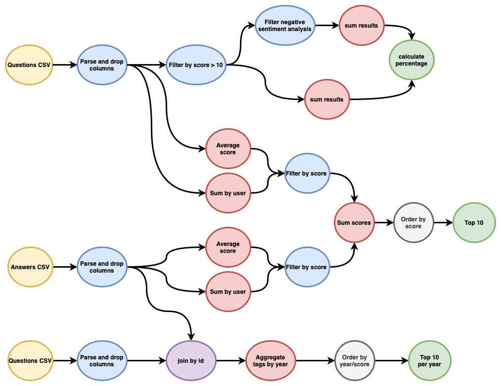
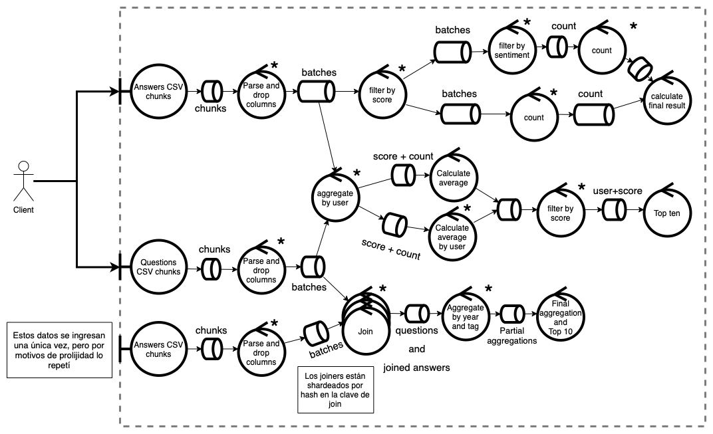

# 75.74 - Sistemas Distribuidos

## TP3

Se solicita un sistema distribuidos que procese un subconjunto de preguntas y respuestas de Stack Overflow
 * La información será provista en archivos CSV
 * El procesamiento de los datos debe brindar la siguiente información:
    * Porcentaje de respuestas con score mayor a 10 que posea un sentiment analysis negativo
    * Top 10 de usuarios según score total (preguntas + respuestas), que tengan un puntaje promedio de preguntas mayor a la media general y un puntaje promedio de respuestas mayor a la media general
    * Top 10 de tags con mayor score (incluye preguntas y respuestas) de cada año
* Como origen de datos se definen los archivos de ingreso registrados en
    * https://www.kaggle.com/ezetowers/tp2-stackoverflow-data-analysis


**El sistema debe ser altamente disponible**

## [DAG de procesamiento](https://app.diagrams.net/#G148Xbc1R3-MDUGZYjM6SZIFoEC09bTu2z)

El siguiente gráfico representa el DAG de flujo de la información para obtener los resultados solicitados:



## [Diagrama de robustez](https://app.diagrams.net/#G1Ju8bDw8lI_rvwq1cTl5qs-Z8LIj5t_4b)

El siguiente diagrama de robustez muestra, además del flujo de información, los actores presentes en el sistema y su paralelismo:




## Ejecución

### Datos

El primer paso es descargar el dataset.

  1. [answers.csv](https://www.kaggle.com/ezetowers/tp2-stackoverflow-data-analysis/data?select=answers.csv)
  2. [questions.csv](https://www.kaggle.com/ezetowers/tp2-stackoverflow-data-analysis/data?select=questions.csv)

Una vez descargados, des-zippear el contenido, crear una carpeta `./data` en el directorio donde se clonó este repositorio y mover los archivos CSV resultantes allí.

El resultado debe ser:

```
data/
    answers.csv
    answers.csv
doc/
    ...
<etc>
```

### Pipeline

Para levantar el sistema se debe ejecutar:

```shell
make run
```

Este comando crea un `docker-compose.py` mediante el script `compose_builder.py`. Este script lee la configuración de workers desde [service_config.py](service_config.py) y genera una configuración de acuerdo a ella.

### Cliente

Para ejecutar el cliente primero es necesario generar la imagen de Docker. Luego, se deben configurar las variables de entorno:

 1. `LINES_PER_CHUNK`: cantidad de líneas por chunk que se envía al pipeline.
 2. `NUM_CHUNKS`: cantidad de chunks de cada archivo a enviar. De ser un valor negativo, se envía el archivo completo.
 3. `CORRELATION_ID`: fuerza a utilizar el ID de request indicado.


```shell
make image
LINES_PER_CHUNK=1000 NUM_CHUNKS=100 CORRELATION_ID=1234 make client
```

## Middleware

Cada tarea en el flujo de ejecución consta de una función que lee de una cola de entrada y escribe en una o varias colas de salida para las siguientes tareas. Este grafo de ejecución está descripto en [middleware.py](middleware.py) como una lista de adyacencias indicando el orden de las tareas.

Como hay tareas que requieren saber cuando el paso anterior terminó de enviar mensajes, se implementó un protocolo en el cual cada worker envía un mensaje `DONE` (paquete vacío) a cada worker de la tarea siguiente (así propagando la señal de finalización).

El middleware abstrae esto combinando la información de [service_config.py](service_config.py) y el grafo de dependencias. De esta forma, cuando una tarea termina de procesar información, automáticamente se envía la señal `DONE` a la etapa siguiente. Esta lógica está implementada el decorador `as_worker` que envía la señal al terminar la función decorada.

La función `consume_from` retorna un stream de mensajes entrada desde la cola indicada. Esta función oculta además los mensajes `DONE` recibidos de la etapa anterior, finalizando el stream una vez que se recibieron todos los mensajes `DONE`.

De esta forma el pipeline es fácilmente configurable con distinta cantidad de workers en cada etapa manteniendo todo el sistema sincronizado.
